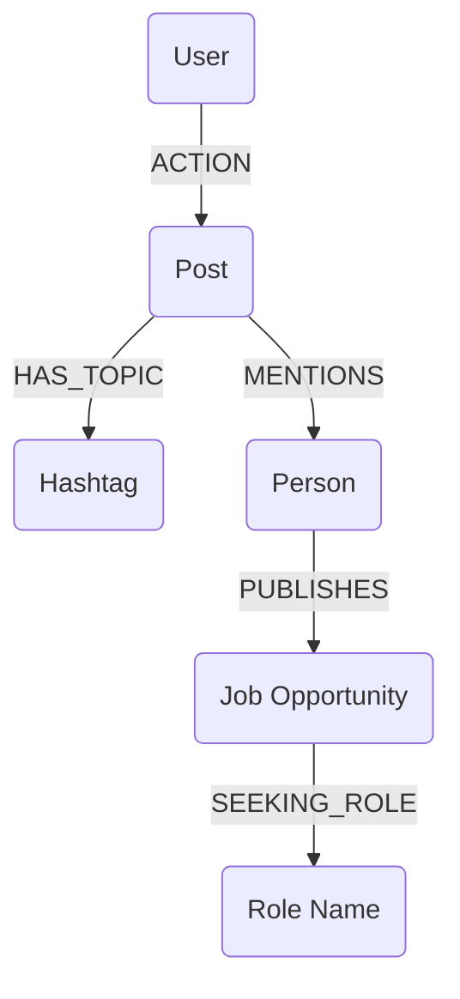

# Strategia di Potenziamento della Raccolta Dati

Questo documento delinea le evoluzioni necessarie per il motore di ingestion dei dati per massimizzare il valore della **Warm Reach Map** e sbloccare nuove feature di intelligenza.

## 1. Monitoraggio Totale del Feed (Invisibile)
Attualmente inviamo solo i dati dei post su cui l'utente interagisce o apre l'overlay.
- **Obiettivo**: Inviare al backend tutti i post che passano nel viewport del feed, anche quelli "ignorati".
- **Perché**: Questo permette di mappare le relazioni tra persone che l'utente *non* conosce ancora ma che gravitano nella sua orbita, accelerando la crescita del grafo.
- **Implementazione**: Utilizzare un `IntersectionObserver` nel content script per rilevare quando un post è stato visibile per >2 secondi e inviare un evento `post_viewed` leggero.

## 2. Estrazione Semantica: Tag e Hashtag
I post contengono connessioni esplicite che oggi non mappiamo.
- **Tag (@mentions)**: Estrarre lo slug e il nome di ogni persona taggata nel post.
  - **Graph**: Creare una relazione `(p1:Person)-[:MENTIONED]->(p2:Person)` dentro il contesto di un `Post`.
- **Hashtag (#)**: Estrarre gli hashtag per categorizzare i contenuti.
  - **Graph**: Creare nodi `:Topic` e collegarli al post `(Post)-[:HAS_TOPIC]->(Topic)`.
- **Valore**: Permette di trovare "esperti di settore" (chi usa certi hashtag) e "connettori" (chi tagga spesso altri).

## 3. Intelligence sul Reclutamento (Job Hunters)
Identificare chi detiene il budget e le opportunità.
- **Riconoscimento**: Filtrare i post per parole chiave legate al hiring ("hiring", "cerchiamo", "opportunità", "we are looking for").
- **Persona Role**: Marcare i nodi `Person` che pubblicano annunci come `IS_HIRING: true` o con una label specifica `:Publisher`.
- **Salvataggio Annunci**: Estrarre e salvare il testo dell'annuncio per identificare i **ruoli cercati** (es. "Frontend Dev", "Product Manager").
- **Valore (Mappa dei Ponti)**: La Warm Reach Map potrà suggerirti non solo come arrivare a una persona, ma come arrivare a una persona che **sta assumendo attivamente** per un ruolo compatibile con il tuo.

## 4. Nuove Relazioni nel Grafo

## 5. AI Intelligence Layer: Utilizzo dei Nuovi Dati
L'arrivo di questa mole di dati "non filtrati" trasformerà l'IA da semplice generatore di testi a vero e proprio **motore di business intelligence**.

### A. Estrazione Strutturata dai Job Post (Claude 4.5)
Invece di salvare il testo grezzo, useremo l'IA per mappare i dati degli annunci:
- **Entità**: Ruolo, Seniority, Tech Stack, Range Salariale (se presente).
- **Matching**: L'IA segnalerà proattivamente: *"Questo post cerca un React Dev. Hai un ponte di forza 8 verso l'autore tramite [Nome Collegamento]"*.

### B. Scoring delle Relazioni tramite Menziomni
Analizzando chi tagga chi nei post visualizzati nel feed:
- **AI Analytics**: L'IA calcolerà il "Peso del Legame". Se A tagga spesso B, il "ponte" è molto forte (Endorsement Implicito).
- **Copywriting**: Nel generare il commento, l'IA suggerirà: *"Cita @[Nome] in questo commento poiché interagisce spesso con l'autore su questi temi"*.

### C. Analisi dei Trend e "Orbiting"
Con i dati di tutto il feed, l'IA può mappare i **Cluster di Interesse**:
- **Discovery**: *"In questi giorni la tua 'orbita' sta parlando molto di [Topic X]. Dovresti scrivere un post su questo per intercettare il trend"*.
- **Pre-warming**: L'IA può suggerire scopi del tipo: *"Fatti notare da [Target] commentando questo post di un suo collaboratore stretto che hai appena visualizzato"*.

### D. Filtro Intelligente del Feed
Invece dell'algoritmo di LinkedIn, useremo un'IA locale (o server-side) per:
- **Priority Scoring**: Ordinare il feed in base a quanto un post è "utile" per i tuoi obiettivi di networking (es. post di potenziali clienti o job hunters).
- **Ghost Writing Assistito**: L'IA inizierà a preparare "bozze silenziose" dei commenti mentre scorri, pronte per essere validate in un clic.
