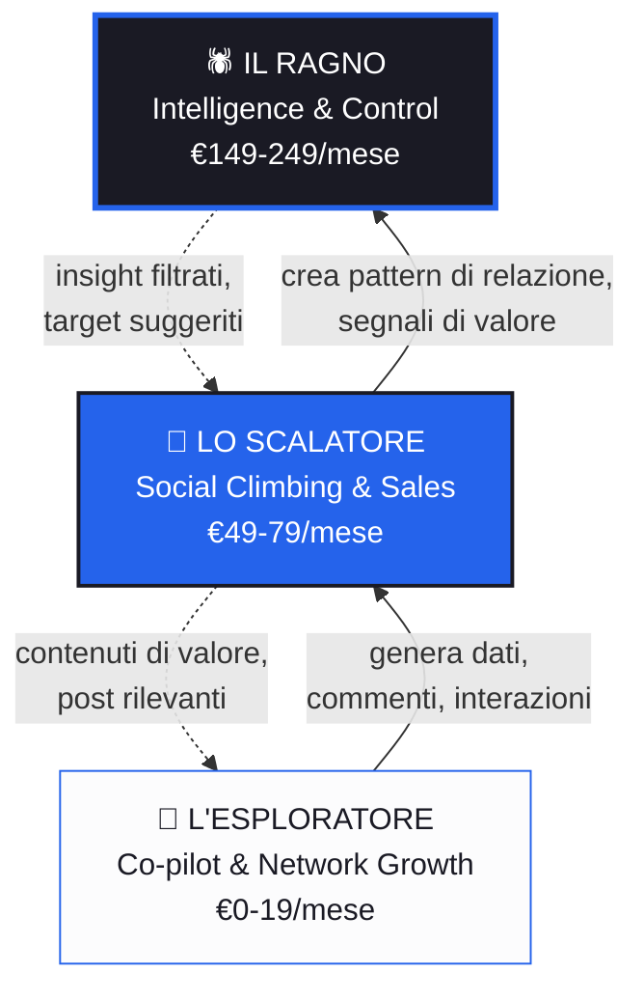
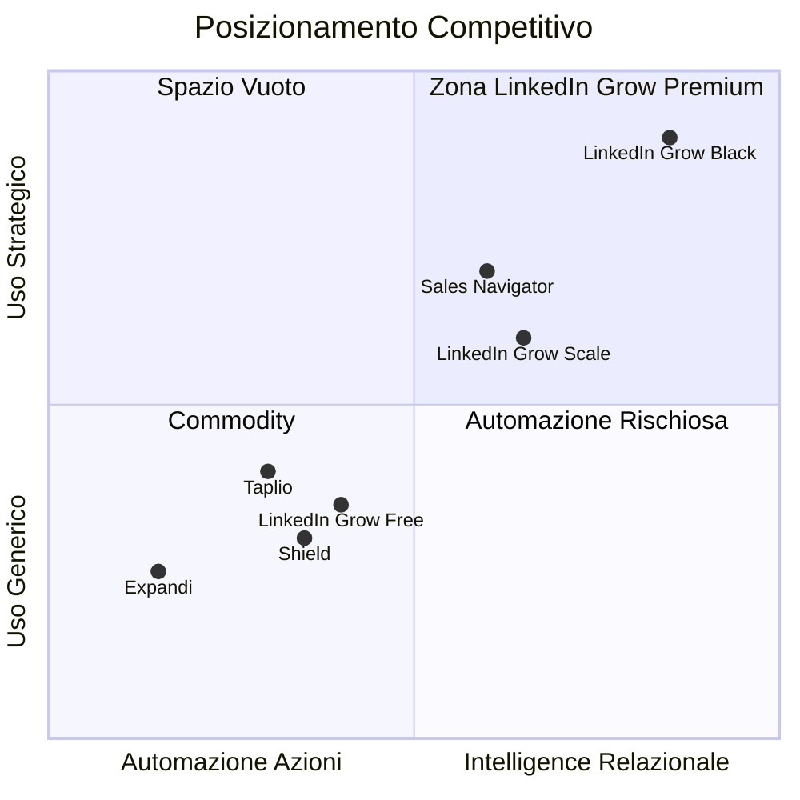

# LinkedIn Grow — Personas, Piramide del Valore e Pricing

*Ultimo aggiornamento: 27 Febbraio 2026*

---

## La Piramide del Potere

Il modello non è lineare — è **una catena alimentare**. Ogni livello produce dati, interazioni e segnali che alimentano il livello superiore. Tutti trovano valore, ma il valore cambia natura salendo.

> [!IMPORTANT]
> La piramide funziona perché ogni livello **ha bisogno** degli altri. L'Esploratore genera il volume di interazioni, lo Scalatore crea relazioni di qualità, il Ragno estrae intelligence da tutto il sistema. Bloccare un livello uccide l'ecosistema.

---

## 🌱 Persona 1: L'Esploratore

### Profilo

| Attributo | Dettaglio |
|-----------|----------|
| **Archetipo** | Professionista che sa di "dover fare networking" ma non lo fa |
| **Età** | 28-42 anni |
| **Ruolo** | Developer, PM, consulente, freelance, dipendente mid-level |
| **Rapporto con LinkedIn** | Lo apre 1-2 volte a settimana, scrolla senza interagire |
| **Credenza limitante** | "LinkedIn è per chi fa personal branding, non per me" |
| **Budget mentale** | €0-20/mese — spende solo se vede risultato immediato |

### Psicologia Profonda

**Motivazione intrinseca:** Non vuole "fare networking" — vuole **non sentirsi tagliato fuori**. La vera paura è l'irrilevanza professionale silenziosa: vedere colleghi che avanzano, ricevono offerte, vengono citati, mentre lui resta invisibile.

**Pattern comportamentale:**
- Apre LinkedIn → scrolla passivamente → si sente inadeguato → chiude
- Sa che dovrebbe commentare ma **non sa cosa dire** senza sembrare banale
- Ha talento nel suo campo ma zero capacità/volontà di "esporsi"

**Bias psicologici attivi:**
- **Status-Quo Bias** → "Ho sempre fatto senza, perché cambiare?"
- **Paradox of Choice** → "Non so neanche da dove iniziare"
- **Regret Aversion** → "Se scrivo qualcosa di stupido?"
- **Activation Energy** → Il primo commento è il muro più alto

### Jobs to Be Done

1. **Funzionale:** "Aiutami a commentare in modo intelligente senza doverci pensare troppo"
2. **Emotivo:** "Fammi sentire che sto facendo qualcosa di utile per la mia carriera"
3. **Sociale:** "Che i miei commenti non sembrino generati dall'AI"

### Valore da Consegnare

| Cosa | Perché conta |
|------|-------------|
| **Co-pilot AI per commenti** | Elimina l'activation energy — non parte da foglio bianco |
| **Scansione feed automatica** | Trova post rilevanti senza scrollare per 30 minuti |
| **Contesto professionale** | Commenti che suonano come lui, non come un bot |
| **Reading list** | Salva post per interagire dopo, quando ha tempo |
| **Statistiche base** | "Questa settimana hai commentato 8 volte" — gamification leggera |

### Obiezioni e Come Superarle

| Obiezione | Risposta psicologica |
|-----------|---------------------|
| "Non ho soldi per questo" | Free tier generoso → **Zero-Price Effect**. Quando vede risultati, il passaggio a €19 è naturale |
| "I commenti AI si vedono" | Demo live dei commenti personalizzati con contesto del profilo → **Seeing is believing** |
| "Non ho tempo" | "5 minuti al giorno, il co-pilot fa il resto" → **Mental Accounting** del tempo |
| "Non serve a niente" | Mostrare metriche: +40% visite profilo dopo 2 settimane → **Social Proof** numerico |

### Pricing — L'Esploratore

| Piano | Prezzo | Include |
|-------|--------|---------|
| **Free** | €0 | 5 commenti AI/giorno, scansione feed base, reading list, statistiche settimanali |
| **Starter** | €19/mese | Commenti illimitati, contesto professionale avanzato, scansione personalizzata, filtro per grado di connessione |

**Metrica di valore:** Numero di commenti AI generati/giorno.

**Strategia di conversione:** Free → Starter via **Endowment Effect**: dopo 2 settimane di uso gratuito, l'Esploratore ha costruito un'abitudine. Togliergli la velocità del co-pilot (limitare a 5/giorno) crea friction sufficiente per upgradare.

> [!TIP]
> **Critica al lavoro attuale:** L'API key Anthropic inserita manualmente dall'utente è un killer per l'Esploratore. Lui non sa cosa sia un'API key. Per questa persona è **indispensabile** che il backend gestisca le chiamate AI. Il costo Claude si copre con il prezzo del piano Starter.

---

## 🧗 Persona 2: Lo Scalatore

### Profilo

| Attributo | Dettaglio |
|-----------|----------|
| **Archetipo** | Professionista ambizioso, social climber, networker intenzionale |
| **Età** | 32-50 anni |
| **Ruolo** | Sales manager, business developer, founder early-stage, consulente senior, broker |
| **Rapporto con LinkedIn** | Lo usa quotidianamente come strumento di lavoro |
| **Credenza forte** | "Il tuo network è il tuo net-worth" |
| **Budget mentale** | €50-100/mese — lo confronta a un pranzo di networking al mese |

### Psicologia Profonda

**Motivazione intrinseca:** Vuole **accesso**. Non connessioni qualunque — vuole entrare nelle stanze dove si prendono le decisioni. Il suo obiettivo non è visibilità generica ma **vicinanza strategica** a persone di potere economico (founder, investitori, C-level, gestori di fondi).

**Pattern comportamentale:**
- Identifica un target (imprenditore, VC, decision-maker)
- Cerca il percorso più breve per entrarci in contatto
- Commenta strategicamente sui post giusti per farsi notare
- Passa al DM solo quando ha "scaldato" il contatto
- Misura il ROI del suo tempo su LinkedIn in termini di deal/opportunità

**Bias psicologici attivi:**
- **Mimetic Desire** → Vuole ciò che hanno le persone che ammira
- **Goal-Gradient Effect** → Più è vicino al target, più accelera
- **Commitment & Consistency** → Una volta investito in un percorso, lo completa
- **Authority Bias** → Deferisce a chi ha status; vuole essere percepito come autorevole
- **Network Effects** → Capisce istintivamente che ogni connessione ne sblocca altre

### Jobs to Be Done

1. **Funzionale:** "Mostrami la strada più corta per raggiungere questa persona"
2. **Emotivo:** "Fammi sentire che sto scalando, che ogni settimana il mio network è più forte"
3. **Sociale:** "I miei commenti devono posizionarmi come pari, non come follower"

### Valore da Consegnare

| Cosa | Perché conta |
|------|-------------|
| **Warm Reach Map** | LA killer feature — percorsi bridge documentati verso target specifici |
| **Bridge comment AI** | Commento generato per il contesto esatto del post bridge |
| **Target tracking** | "Hai raggiunto 3 target questa settimana, 2 hanno risposto al tuo commento" |
| **Network insights** | Top roles nella rete, crescita connessioni qualitative, "alleati" |
| **Portfolio di contatti** | Marca i contatti di valore, traccia la progressione della relazione |
| **Filtri per affinità** | Mostra solo post di contatti con certi ruoli/seniority/settore |

### Obiezioni e Come Superarle

| Obiezione | Risposta psicologica |
|-----------|---------------------|
| "Uso già Sales Navigator" | "Sales Navigator mostra connessioni ufficiali. Noi mostriamo **interazioni reali**" → differenziazione netta |
| "€79/mese sono tanti" | "Quanto vale un meeting con un VC? Un deal da €50K chiuso grazie a un bridge contact?" → **Mental Accounting** spostato su revenue |
| "Non ho tempo per il dashboard" | "Il sistema ti notifica quando un target interagisce. Tu decidi solo se agire" → push vs pull |
| "Come faccio a fidarmi dei suggerimenti?" | "Ogni percorso bridge è basato su interazioni pubbliche tracciate dal tuo feed" → trasparenza dati |

### Pricing — Lo Scalatore

| Piano | Prezzo | Include |
|-------|--------|---------|
| **Growth** | €49/mese | Tutto lo Starter + Warm Reach Map (10 target/mese), bridge comments AI, network insights base, portfolio contatti |
| **Scale** | €79/mese | Target illimitati, insights avanzati (top roles, trend, alleati), tracking follow-up con notifiche, filtri affinità, priorità supporto |

**Metrica di valore:** Numero di target raggiungibili / percorsi bridge disponibili.

**Strategia di conversione:** Starter → Growth via **Loss Aversion**: lo Scalatore vede la Warm Reach Map nella dashboard ma con un overlay "Sblocca questa funzionalità". Sa che i percorsi ci sono, sa che stanno scadendo (i bridge sono temporanei — basati su post recenti). La paura di perdere un percorso bridge verso un target desiderato è potentissima.

> [!WARNING]
> **Critica al lavoro attuale:** La Warm Reach Map è la feature che giustifica il prezzo alto, ma **richiede un volume critico di dati**. Servono almeno 2-3 settimane di uso quotidiano prima che il grafo Neo4j abbia abbastanza nodi per generare percorsi bridge significativi. Rischio: lo Scalatore paga €49-79, non vede valore immediato, cancella al primo mese. **Soluzione:** periodo di "riscaldamento grafo" nel free/starter tier prima di proporre l'upgrade, con indicatore visivo di quanto manca al grafo per essere "maturo".

---

## 🕷️ Persona 3: Il Ragno

### Profilo

| Attributo | Dettaglio |
|-----------|----------|
| **Archetipo** | Power player silenzioso, analista strategico, influencer sommerso |
| **Età** | 38-55 anni |
| **Ruolo** | Investor relations, head of BD, partner di fondi, lobbyist, senior advisor, CEO di PMI |
| **Rapporto con LinkedIn** | Lo usa come **sensore**, non come megafono |
| **Credenza forte** | "L'informazione è potere. Chi la ha prima vince" |
| **Budget mentale** | €150-300/mese — lo confronta a un abbonamento Bloomberg/Crunchbase |

### Psicologia Profonda

**Motivazione intrinseca:** Vuole **vedere senza essere visto**. Non gli interessa il co-pilot perché non vuole commentare — vuole sapere **chi sta commentando cosa, chi si sta avvicinando a chi, quali cluster di relazione si stanno formando**. Il suo potere viene dal sapere cose che gli altri non sanno.

**Pattern comportamentale:**
- Non commenta, non posta, o lo fa raramente e strategicamente
- Scrolla il feed per **leggere i segnali deboli**: chi loda chi, chi cambia tono, chi sta reclutando
- Vuole dashboard, non popup; report, non notifiche
- Prende decisioni basate su pattern che ha riconosciuto prima degli altri
- Se un tool non gli fa risparmiare tempo rispetto al farlo manualmente, non paga

**Bias psicologici attivi:**
- **Information Asymmetry** → Il suo edge è sapere più degli altri
- **Survivorship Bias** → Sa evitarlo — vuole vedere anche chi fallisce, chi si ritira, chi cambia direzione
- **Second-Order Thinking** → Non guarda cosa succede, guarda **cosa succederà dopo**
- **Switching Costs** → Alto lock-in una volta che i dati sono accumulati — diventa dipendente dal grafo
- **Circle of Competence** → Resta nel suo dominio, ma vuole essere il più informato al suo interno

### Jobs to Be Done

1. **Funzionale:** "Dammi insight che altri tool non danno, nel minor tempo possibile"
2. **Emotivo:** "Fammi sentire di avere un vantaggio informativo sugli altri"
3. **Sociale:** "Nessuno deve sapere che uso questo tool"

### Valore da Consegnare

| Cosa | Perché conta |
|------|-------------|
| **Mappa relazionale completa** | Grafo navigabile di chi interagisce con chi, con pesi e frequenze |
| **Cluster detection** | "Queste 5 persone hanno iniziato a interagire tra loro questa settimana" — segnale di deal, progetto, o alleanza |
| **Trend engine** | Argomenti emergenti nel suo network prima che diventino mainstream |
| **Sentiment shift** | Cambiamenti di tono: chi sta diventando critico verso un'azienda, chi sta elogiando un concorrente |
| **Bridge analysis passivo** | Non "chi puoi raggiungere" ma "chi sta raggiungendo chi" — intelligence sulla competizione |
| **Export & report** | Dati esportabili, report settimanali, API per integrare con i suoi sistemi |
| **Affidabilità della fonte** | Ogni insight è tracciabile al dato originale (post, commento, timestamp) |

### Obiezioni e Come Superarle

| Obiezione | Risposta psicologica |
|-----------|---------------------|
| "Posso farlo da solo" | "Puoi, in 3 ore al giorno. Noi lo facciamo in 30 secondi" → **Opportunity Cost** del tempo |
| "Come so che i dati sono affidabili?" | Ogni insight linkato alla fonte originale + metodologia trasparente → **Authority Bias** sui dati |
| "€249/mese è troppo" | "Sales Navigator Advanced costa €180/mese e non ti dà intelligence sulle relazioni. Bloomberg costa €2000/mese" → **Anchoring** |
| "Non voglio lasciare tracce" | "Il plugin raccoglie solo dal tuo feed. Non posta, non commenta, non connette mai per tuo conto" → **Privacy by design** |

### Pricing — Il Ragno

| Piano | Prezzo | Include |
|-------|--------|---------|
| **Intelligence** | €149/mese | Mappa relazionale, cluster detection, trend engine, report settimanali, bridge analysis passivo |
| **Black** | €249/mese | Tutto Intelligence + sentiment analysis, export API, report personalizzabili, SLA dedicato, onboarding 1:1 |

**Metrica di valore:** Numero di insight unici / cluster rilevati / report generati.

**Strategia di conversione:** Il Ragno non segue il funnel tradizionale. Non entra dal free tier. Lo raggiungi con:
- **Content marketing B2B** mirato (articoli su "network intelligence", "relationship mapping")
- **Referral** da Scalatori che conoscono persone giuste
- **Demo 1:1** dove mostri il grafo con i suoi dati (dopo periodo di onboarding)

> [!CAUTION]
> **Critica al lavoro attuale:** Oggi LinkedIn Grow non ha quasi nulla di ciò che serve al Ragno. Le feature esistenti (co-pilot, overlay commenti, reading list) sono irrilevanti per lui. Il valore per il Ragno è quasi interamente nella **dashboard + intelligence layer** che è ancora in roadmap. Il Ragno è la persona che giustifica il pricing premium, ma le feature che lo servono sono le più complesse da costruire. **Priorità di sviluppo suggerita:** 1) Completare la raccolta dati co-commenters, 2) Mappa relazionale base, 3) Cluster detection.

---

## Analisi Competitiva e Posizionamento

### Mappa del Mercato

| Tool | Cosa fa | Prezzo | Cosa gli manca |
|------|---------|--------|---------------|
| **Taplio** | Content creation + scheduling | €39-199/mese | Zero intelligence relazionale, nessun grafo |
| **Shield** | Analytics sui propri post | €15-29/mese | Solo analytics "verso l'esterno", nessun insight sulla rete |
| **AuthoredUp** | Formatting post | ~€20/mese | Solo styling, zero strategia |
| **Sales Navigator** | Lead finding + InMail | €80-180/mese | Basato su connessioni ufficiali, non su interazioni reali |
| **Expandi/Dripify** | Automazione outreach | €59-99/mese | Spam automatizzato, rischio ban account |
| **LinkedIn Grow** | **Network intelligence + AI co-pilot** | €0-249/mese | Da costruire: mappa relazionale, cluster, sentiment |

### Differenziazione Chiave

> [!NOTE]
> LinkedIn Grow è l'**unico tool** nella zona "intelligence relazionale + uso strategico" alto. Sales Navigator ci si avvicina ma usa connessioni formali, non interazioni reali. Questo è il moat.

---

## Riepilogo Pricing Completo

| Piano | Persona target | €/mese | €/anno (-20%) | Metrica |
|-------|---------------|--------|---------------|---------|
| **Free** | Esploratore curioso | €0 | €0 | 5 commenti/giorno |
| **Starter** | Esploratore motivato | €19 | €182 | Commenti illimitati |
| **Growth** | Scalatore base | €49 | €470 | 10 target bridge/mese |
| **Scale** | Scalatore avanzato | €79 | €758 | Target illimitati |
| **Intelligence** | Ragno base | €149 | €1.430 | Report + cluster |
| **Black** | Ragno power user | €249 | €2.390 | API + SLA + onboarding |

### Psicologia del Pricing Page

- **Anchoring:** Mostrare il piano Black primo (€249) fa sembrare Scale (€79) un affare
- **Decoy Effect:** Growth a €49 è il decoy — Scale a €79 offre molto di più (+60% prezzo, +300% valore)
- **Default Effect:** Pre-selezionare Scale come "Più Popolare"
- **Mental Accounting:** Per il Ragno, presentare il prezzo annuale come "€6.5/giorno — meno di un caffè con un investor"

---

## Critiche e Rischi Principali

### 1. Il Problema dell'API Key
Il setup attuale richiede che l'utente inserisca la propria API key Anthropic. Questo è un killer assoluto per l'Esploratore (non sa cosa sia) e uno friction inutile per lo Scalatore. Solo il Ragno potrebbe tollerarlo. **Azione: gestire le chiamate AI lato server**, il costo Claude va integrato nel prezzo dei piani.

### 2. Il Cold Start del Grafo
La Warm Reach Map e l'intelligence richiedono settimane di raccolta dati. Il rischio è che gli utenti paghino e non vedano valore immediato. **Azione:** grafo "riscaldamento" con indicatore visivo, onboarding che spiega cosa aspettarsi e quando.

### 3. La Privacy del Ragno
Il Ragno vuole invisibilità. Qualsiasi feature che esponga la sua attività (commenti, post, interazioni) è una minaccia. **Azione:** separare nettamente le feature "attive" (co-pilot) da quelle "passive" (intelligence). Il piano Intelligence/Black può essere usato senza mai attivare il co-pilot.

### 4. La Dipendenza da LinkedIn DOM
Il plugin scrapa il DOM di LinkedIn, che cambia frequentemente. Ogni aggiornamento di LinkedIn può rompere il plugin. **Azione:** non promettere SLA aggressivi nei piani Ragno fino a quando non c'è stabilità consolidata; investire in detection automatica dei cambiamenti DOM.

### 5. Feature Priorità vs Ambizione
Oggi il prodotto serve solo l'Esploratore (co-pilot + overlay). Scalatore e Ragno sono in roadmap, non in produzione. **Azione:** strategia di go-to-market in fasi:
- **Fase 1 (ora):** Lanciare Free + Starter per Esploratori, generare volume e dati
- **Fase 2 (mese 2-3):** Growth + Scale per Scalatori, attivare Warm Reach Map
- **Fase 3 (mese 4-6):** Intelligence + Black per Ragni, intelligence layer completo
